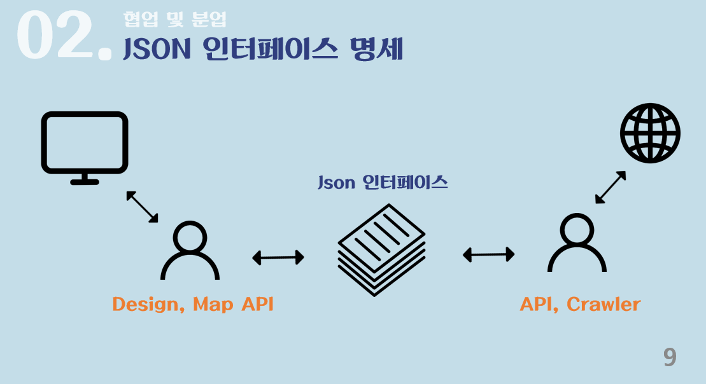
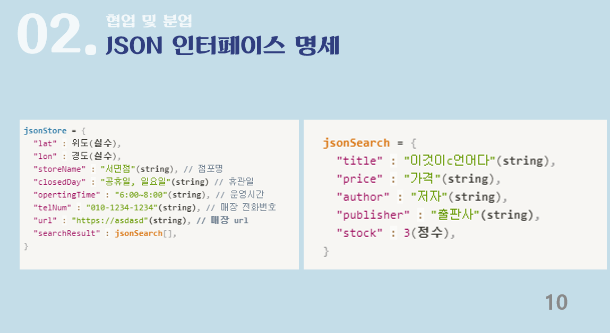

<h1>Hello, This Project is 'books near with you'</h1>
<h6> 당신 근처의 책을 찾아주는 위치기반 도서 검색 서비스입니다. </h6>

  

<h2> 이렇게 개발했어요 ! </h2>
<h6>서버 없는 프로젝트이며, 협업을 위해 특정 함수에 넘겨줄 파라메타를 아래와 같이 지정해 협업을 할 수 있었어요 ! </h6>

   
<h2> 어떻게 만들었나요? </h2>
<h6>
    부경대학교 컴퓨터공학과 4명에서 '웹 프로그래밍'수업을 통해 만들었어요. 다양한 도서 제공 공공 API와 JS를 통한 크롤러로 만들었어요 !
</h6>
 
</a> </a>&nbsp </a> </a>&nbsp

   

<h2> 결과물 확인하기 </h2>
<h6>
    코드와 함께 첨부되어 있는 ppt와 hwp를 확인해보시면 됩니다 ! 
</h6>

  

</h2> Team Information </h2>

<!--  아래는 Team INFORMATION 표-->

 <table>
<thead>
<tr>
<th style="text-align:left">Team</th>
<th style="text-align:left">Name</th>
<th style="text-align:left">Position</th>
<th style="text-align:left">E-Mail</th>
<th style="text-align:left">Github</th>
</tr> 
</thead>
<tbody>
<tr>
<td style="text-align:left">Leader</td>
<td style="text-align:left">한준규</td>
<td style="text-align:left">Project Manager, FrontEnd Develop</td>
<td style="text-align:left">must1080@naver.com</td>
<td style="text-align:left"></td> 
</tr>
     <tr>
<td style="text-align:left">Team</td>
<td style="text-align:left">김동건</td>
<td style="text-align:left">FrontEnd Develop</td>
<td style="text-align:left">gbdngb12@naver.com</td>
<td style="text-align:left"></td>
</tr>
<tr>
<td style="text-align:left">Team</td>
<td style="text-align:left">강지석</td>
<td style="text-align:left">UI/UX Design and Develop</td>
<td style="text-align:left">gotrain1126@gmail.com</td>
<td style="text-align:left"></td>
</tr>
 <tr>
<td style="text-align:left">Team</td>
<td style="text-align:left">윤어진</td>
<td style="text-align:left">UI/UX Design and Develop</td>
<td style="text-align:left">dbsdjwls456@naver.com</td>
<td style="text-align:left"></td>
</tr>
</tbody>
</table>

  

